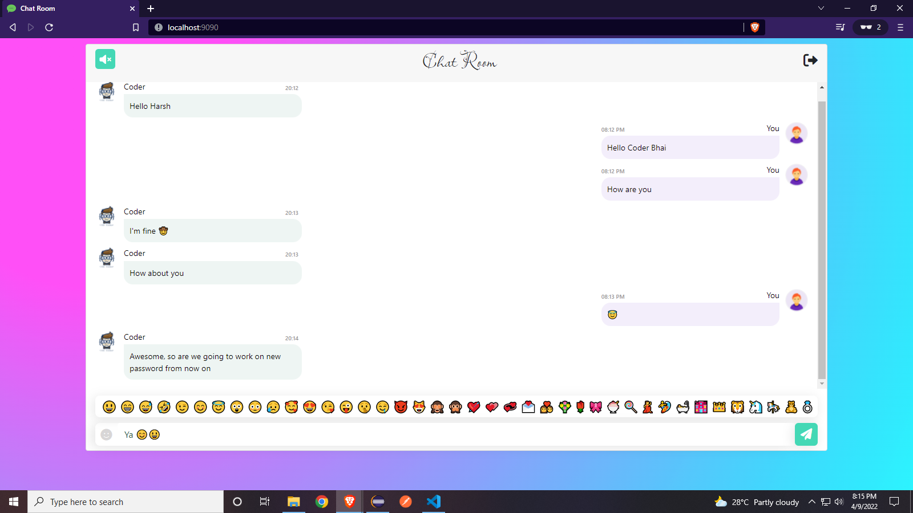
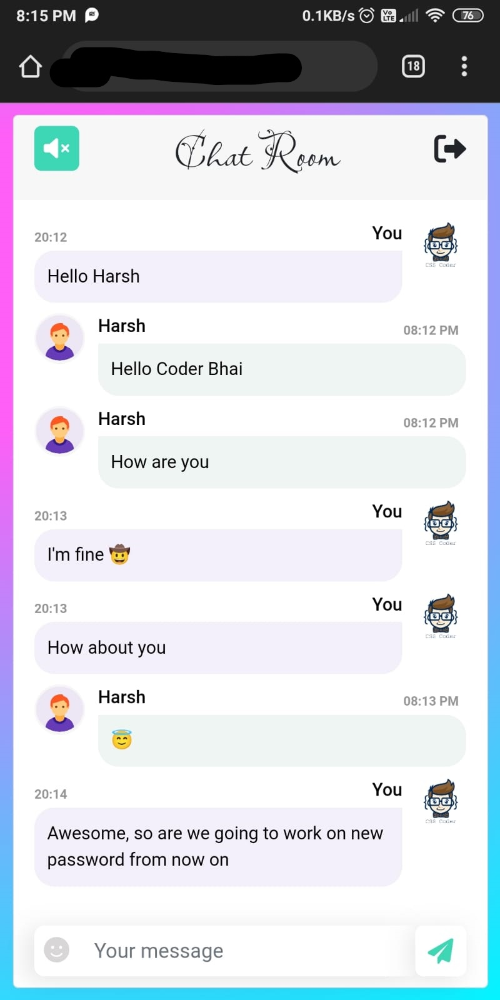

# 𝕮𝖍𝖆𝖙 𝕽𝖔𝖔𝖒 𝓐𝖕𝖕𝖑𝖎𝖈𝖆𝖙𝖎𝖔𝖓 💭

> Simple Chat application made using Spring Boot

### Table of Contents

- [Description](#description)
- [How To Use](#how-to-use)

## Demo screens

   

## Description

Chat with random Guest without Registration. Enter a nickname to select an avatar, and start chat with others.
This is just a Simple Chat Room Application made using Spring Boot.

## Tech Stack

**Client:** HTML, CSS, Bootstrap, JavaScript

**Server:** Spring Boot


## How to use

You can use this url to access chat room in your Desktop browser.
> URL : ``` http://localhost:9090```

If you want access chat room on your moblie device. Then just replace ```localhost``` with your system's IP address.

> Note: Both devices should be connected to same network.

---

## License

[MIT](https://choosealicense.com/licenses/mit/)
